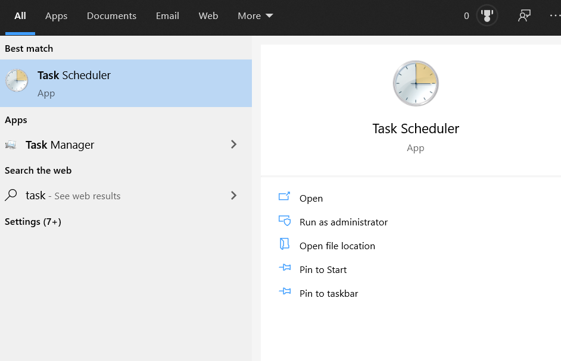
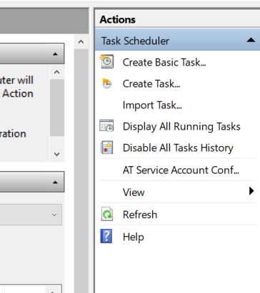
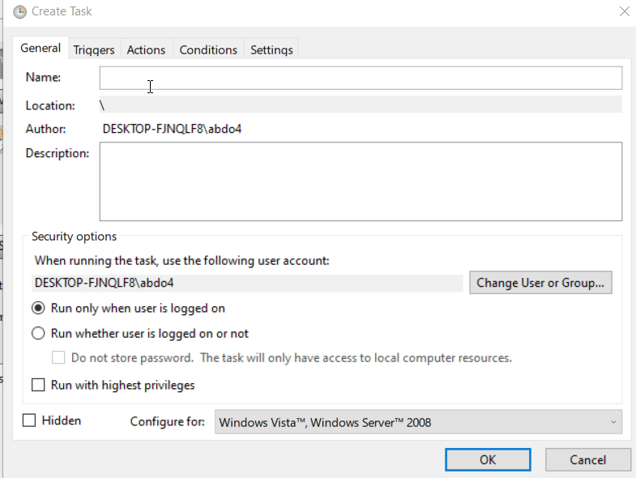
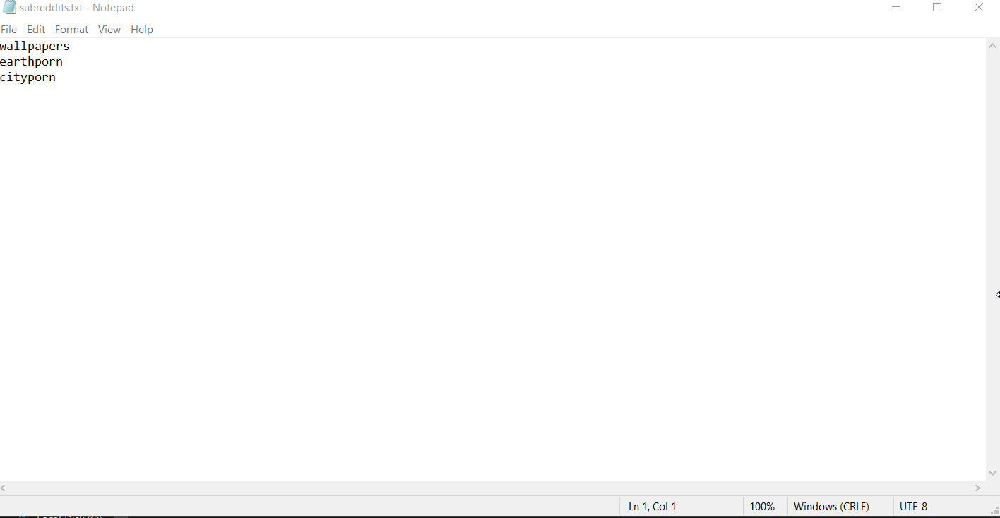

# Simple Guide for Task Scheduling
This is a simple guide on how to schedule the bot to change wallpapers daily without any hassle, this is currently a Windows only guide but the principles should work about the same.  

## Part 1: Task Scheduler

### Step 1: Open Task scheduler
Search for the **Task Scheduler** app and open it.  

### Step 2: Create Task 
Click on **Create Task..** near the top right corner.  

### Step 3: Add Trigger & Action
Write the name you want the task to be known as, such as **RedditWallpaperBot** then click on the 'Triggers' tab and add how you want it to be scheduled i.e Daily. Click Ok then click on the 'Actions' tab and copy the path to the `scheduler.pyw` file in the cloned repo to the Program/Script bar then click ok and Done!  

## Part 2: Subreddits list
Open the cloned/downloaded repo directory and create a file named `subreddits.txt` and add the list of subreddits you want the bot to choose randomly from each time like so:

**Enjoy!**  
*Note: you need to install the dependencies globally for this to work, if you installed them in a closed environment you need to edit `scheduler.pyw` subproccess command to open the virtual environment beforehand*