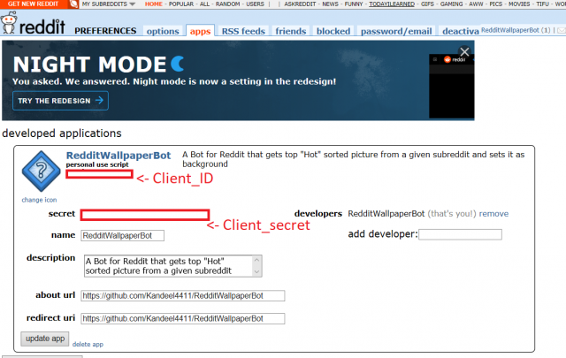

# :sparkler: RedditWallpaperBot :crystal_ball:
[](https://shields.io/)
[](https://pypi.python.org/pypi/ansicolortags/)
[](https://GitHub.com/Naereen/StrapDown.js/graphs/commit-activity)
[](https://www.python.org/)

A Bot for Reddit that gets top Hot sorted picture from a given Subreddit and sets it as background.

## Supported OS & Environments
 Windows, Mac and Linux(Ubuntu, Linux Mint)

## Prerequisite
* Must have python3.6+ installed.

## Installation: :hammer:

* Download the repository by clicking the green "Clone or download" button on the top-right of the repository's main page, then click on "Download ZIP"
* Extract folder to desired location

* With the Reddit account that the bot will use go to Preferences -> Apps and create an app. Pick any name, choose script, and set the redirect url to http://localhost. Description and about url can be blank.

  
  * In etc/config.ini add your client id and client secret from the app you just created. Client id is the id underneath the name of the app. Client secret is labeled.
  * Choose one of the following methods:
    * *Installing in closed environment (Recommended)*:
      * Install pipenv through pip.  
      ` pip install pipenv`

      * Open the extracted folder in terminal and run pipenv install.  
      ` cd RedditWallpaperBot-master && pipenv install `
    * *Installing globally*:
      * Open the extracted folder in terminal and run:  
      ` pip install -r requirements.txt `


## Usage: :robot:


* *if you installed in closed environment*
  * Open extracted folder and run main.py script directly by double clicking.  
  *Or*
  * Open extracted folder in terminal and run:  
  ` pipenv run python main.py `

* *if you installed globally*
  * Open extracted folder in terminal and run:  
  ` python main.py `  

## Task scheduling: :hourglass:
You can follow [this](https://github.com/Kandeel4411/RedditWallpaperBot/wiki/Task-Scheduling-Guide) guide to schedule the bot to run daily!  
  
If you want to use the script directly, you can mention the subreddit name and prompt("-y" or otherwise) as such for automated downloading and setting:
```
python main.py <subreddit_name> <prompt>
```
i.e: `python main.py wallpapers -y`  
If you installed in a closed environment, you may need to append `pipenv run` at the start of the command.

## Running the tests: :wrench:

Tests are written using the [pytest](https://github.com/pytest-dev/pytest) framework. Open terminal and navigate to the project directory

* If you installed globally run:  
`pytest`

* If you installed using the pipenv method:  
  * Run the following command to install pytest:  
  ` pipenv install --dev`
  * Close and re-open the terminal to the project directory and run:  
  `pytest`

## Importing: :package:

* *Notes:*
If you want to import the bot functions, it by default uses sys.exit() to exit program once an error has been caught. You may want to use bot.raise_bot_exception(option=True) to raise BotExceptions instead that you can catch.

### License:
* [MIT](https://github.com/Kandeel4411/RedditWallpaperBot/blob/master/LICENSE)
